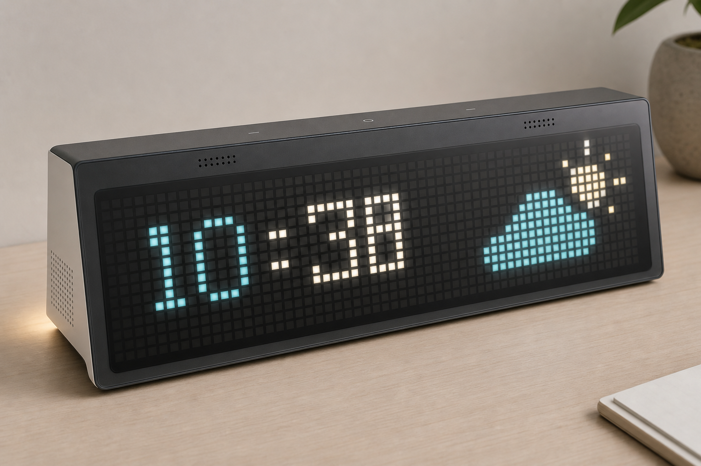
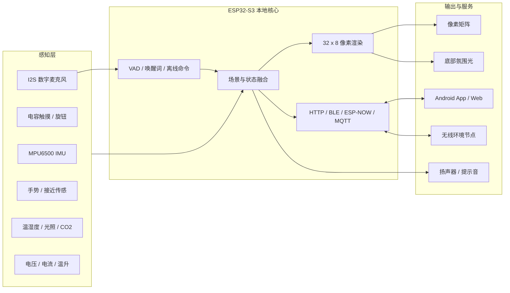

# Pixel Clock V2 硬件与产品化迭代路线

作者：Yang



> 概念图用于确定烟灰前面板、隔光像素、隐藏触摸区、侧向声学开孔和后仰底座的 CMF 方向，不作为 32 x 8 像素数量或结构尺寸依据。

## 1. 迭代结论

结合《全国大学生嵌入式芯片与系统设计竞赛 2026 - 乐鑫科技赛题选题指南》，本项目最适合定位为：

> 基于 ESP32-S3 的多模态 AIoT 桌面陪伴终端，通过像素显示、语音、触摸、姿态、环境感知和手机 App，形成“感知 - 交互 - 连接 - 服务”的完整链路。

建议以指南中的“选题五：智能交互驱动的 AIoT 应用系统”为主线，以“选题四：无线协议与网络应用”为加分项。不建议改投“高性能图形人机交互系统”，因为该方向建议使用不低于 480 x 480 的显示屏，会削弱 32 x 8 像素矩阵的项目识别度。

当前工程已经具备很好的底座：

- ESP32-S3 双核任务架构。
- 32 x 8 WS2812B 像素矩阵。
- Clock、Spectrum、Fluid、Text、Timer、Weather、Game 七类模式。
- MAX9814 音频采集、FFT、MPU6500、HTU21D、LDR 和 VBUS 检测。
- Wi-Fi 配网、Web 控制台、手机 App、NVS 参数保存。
- HTTP/JSON 控制、LiveView、天气和小游戏。

下一版不应继续简单堆叠显示模式，而应补齐三块能力：

1. **自然交互**：触摸、旋钮、手势、离线语音。
2. **产品可靠性**：电流、温升、离线时钟、供电保护和数字传感。
3. **产品观感**：像素光学结构、外壳比例、隐藏式开孔和一致的视觉语言。

## 2. V2 系统架构



## 3. 硬件功能优先级

| 优先级 | 功能 | 推荐器件/方案 | 带来的价值 |
| --- | --- | --- | --- |
| P0 | LED 数据电平转换 | 74AHCT125 / 74HCT245 | 提高 3.3V 到 5V 灯带数据可靠性 |
| P0 | 电流与温升监控 | INA226 + NTC/TMP117 | 形成真实的过流、过温和降亮闭环 |
| P0 | 像素光学前面板 | 黑色隔光格栅 + 扩散片 + 烟灰面板 | 直接改善漏光、热点和廉价感 |
| P1 | 数字音频输入 | ICS-43434 / 同类 I2S MEMS 麦克风 | 代替 MAX9814，降低噪声并释放 ADC |
| P1 | 音频输出 | MAX98357A + 4 欧 3W 扬声器 | 番茄钟、天气、语音和系统提示 |
| P1 | 本机交互 | 三点电容触摸或旋钮带按压 | 脱离手机也能完成主要操作 |
| P1 | 数字环境光 | VEML7700 / BH1750 | 代替 LDR，释放 ADC，亮度更稳定 |
| P1 | 手势与接近 | APDS9960 或 VL53L1X | 挥手切页、靠近唤醒、人走息屏 |
| P1 | 离线时钟 | RV-3028-C7 + 后备电源 | 无网络时仍保持准确时间 |
| P2 | 空气质量 | SCD40 CO2，或 SGP40 VOC | 增加明确的桌面健康价值 |
| P2 | 无线协同 | ESP-NOW 环境节点 / 遥控器 | 呼应竞赛无线协议方向 |
| P2 | 无线存在感知 | Wi-Fi CSI 实验模式 | 纯软件扩展，创新性强 |
| P2 | USB 设备功能 | TinyUSB HID / UAC | 可作为电脑快捷键、媒体控制或 USB 麦克风 |

### 3.1 数字音频与语音

当前 MAX9814 与 VBUS、LDR 共用 ADC1，音频质量和任务调度都受 ADC 资源影响。V2 建议：

- 使用 16 kHz、16 bit 的 I2S MEMS 麦克风。
- 增加 MAX98357A I2S 功放和独立扬声器。
- 麦克风与扬声器不要共用一个声学腔体。
- 麦克风孔布置在前上方，扬声器向侧面或底部出声，二者尽量拉开。
- 在扬声器腔与麦克风之间加入软质密封和吸音材料，减少结构传声。

软件可分两阶段：

1. 保留现有 FFT，可视化直接改用 I2S 音频。
2. 竞赛版迁移到 ESP-IDF 5.5.x，接入 ESP-SR 的 AFE、VAD、WakeNet 和 MultiNet。

推荐离线命令：

- “小像素，显示时间”
- “切换天气”
- “开始专注”
- “暂停计时”
- “亮一点 / 暗一点”
- “进入律动”
- “晚安”

ESP-SR 官方能力包括音频前端、唤醒词和离线命令识别。MultiNet 可在 ESP32-S3 上识别自定义中英文命令，适合本项目，不需要把每次控制都发到云端。

### 3.2 触摸、旋钮和手势

优先推荐的本机交互组合：

- 顶部三个隐藏式触摸区：上一项、确认、下一项。
- 右侧一个带按压旋钮：旋转调亮度/数值，按压确认，长按返回。
- 前方一个接近或手势传感器：挥手换页，靠近唤醒。

ESP32-S3 支持多路电容触摸。原理图应为每个触摸通道预留串联电阻，建议从 510 欧开始实测，并做好 ESD 处理。当前工程的 GPIO8、9、10、11、14 已被占用，不应继续复用为触摸通道。

乐鑫硬件指南同时提示 ESP32-S3 原生触摸的应用场景仍需注意抗扰度，因此参赛样机也要进行充电器插拔、LED 全亮、Wi-Fi 发射和人体静电条件下的误触测试。如果外壳材料、走线或电源噪声导致原生触摸不稳定，应改用 I2C 触摸控制器，而不是通过不断降低阈值补救。

### 3.3 环境与存在感知

环境功能建议从“显示温湿度”升级为“主动场景引擎”：

- 环境变暗：自动进入低亮暖色时钟。
- 人靠近：点亮天气或日程摘要。
- 长时间无人：关闭主矩阵，仅保留极低亮度状态点。
- CO2 超标：用不刺眼的黄色提示并在 App 中给出数值。
- 温度异常或电源温升过高：降低 LED 电流上限。

Wi-Fi CSI 可作为竞赛创新功能，但建议放在独立实验模式：

- CSI 回调只采集数据并送入队列，不能在 Wi-Fi 回调中做复杂计算。
- 先实现“无人 / 有人 / 活动”三分类，不要一开始追求手势识别。
- 若 CSI 影响现有 AP+STA、天气和 App 通信，可使用另一块 ESP32 作为固定发射节点。

### 3.4 离线可靠性

当前时间主要依赖 NTP。V2 建议增加低功耗 RTC：

- 推荐 RV-3028-C7，I2C 地址与现有 MPU6500 不冲突。
- 若使用 DS3231，默认地址 `0x68` 会与 MPU6500 冲突，必须把 MPU6500 的 AD0 拉高改为 `0x69`，或选择其他 RTC。
- RTC 只负责离线守时，联网后仍由 NTP 校准。

## 4. 建议引脚规划

以下规划基于当前 ESP32-S3-DevKitC-1，并保留现有引脚编号。V2 打板前必须根据所用模组、PSRAM/Flash 配置和实际原理图再次核对。

| 功能 | GPIO | 状态 | 说明 |
| --- | ---: | --- | --- |
| WS2812B 主矩阵 | 15 | 保留 | 通过 74AHCT125 转为 5V 逻辑 |
| LED 电源 EN | 16 | 保留 | 控制 LED 电源负载开关/降压模块 |
| VBUS 检测 | 8 | 保留 | V2 中尽量作为唯一 ADC 任务 |
| MAX9814 | 9 | V2 移除 | 改为 I2S 麦克风后释放 |
| LDR | 10 | V2 移除 | 改为数字光照传感器后释放 |
| I2C SDA | 14 | 保留 | 多传感器共用 |
| I2C SCL | 21 | 保留 | 多传感器共用 |
| MPU6500 INT | 11 | 保留 | 姿态中断 |
| BOOT / 用户键 | 0 | 保留 | 只作为维护和应急键 |
| 触摸左 | 1 | 新增 | 原生 Touch 1，串联 510 欧起步 |
| 触摸中 | 2 | 新增 | 原生 Touch 2，串联 510 欧起步 |
| 触摸右 | 12 | 新增 | 原生 Touch 12，串联 510 欧起步 |
| 旋钮 A | 4 | 可选 | 与触摸方案二选一或同时保留 |
| 旋钮 B | 5 | 可选 | 软件消抖 |
| 旋钮按键 | 6 | 可选 | 输入上拉 |
| I2S BCLK | 17 | 新增 | 麦克风和功放共用时钟 |
| I2S LRCLK | 18 | 新增 | 麦克风和功放共用帧时钟 |
| I2S MIC DIN | 7 | 新增 | 数字麦克风输入 |
| I2S SPK DOUT | 13 | 新增 | MAX98357A 数据输出 |
| USB D- / D+ | 19 / 20 | 预留 | Native USB，禁止挪作普通 GPIO |

避免在新增功能中使用 GPIO3、45、46 等启动配置相关引脚。GPIO19/20 应为 USB 功能保留。

## 5. I2C 地址规划

所有模块共用 3.3V I2C 总线时，建议只保留一组有效上拉电阻，避免每个模块都并联上拉。

| 器件 | 建议地址 | 备注 |
| --- | ---: | --- |
| VEML7700 | `0x10` | 数字光照 |
| APDS9960 | `0x39` | 接近/手势 |
| HTU21D | `0x40` | 当前温湿度 |
| INA226 | `0x41` | 通过 A0/A1 避开 HTU21D |
| RV-3028-C7 | `0x52` | RTC |
| SCD40 | `0x62` | CO2 |
| MPU6500 | `0x68` | 当前 IMU |

工程规则：

- 总线尽量保持短线，传感器模块不要用长杜邦线串接。
- 原型板阶段先扫描地址，再启用驱动。
- 所有驱动都必须允许“器件不在线时降级运行”。
- 空气传感器应放在独立通风区，远离 LED、降压芯片和扬声器。

## 6. 电源与热设计

### 6.1 现有风险

256 颗 WS2812B 在全白极限状态下理论电流约为：

```text
256 x 60 mA = 15.36 A
```

当前固件 12V 模式中的 15A 限制只能在电源、降压模块、PCB 铜箔、连接器、线材和散热全部按该电流验证后使用。对于普通桌面产品，建议把正常工作上限控制在 4A 到 6A，并通过亮度、色彩和分时刷新获得足够观感。

### 6.2 V2 电源结构

建议结构：

```text
12V 输入
  -> 保险丝 / 自恢复保险
  -> 反接与浪涌保护
  -> 5V 大电流 Buck
      -> LED 5V 电源域
      -> 逻辑 5V / 3.3V 电源域
```

关键要求：

- LED 电源和逻辑电源分域，在单点汇接地线。
- LED 供电从矩阵两端注入，长矩阵应增加中间注入点。
- 数据线靠近矩阵端串联 220 到 470 欧电阻。
- 矩阵电源入口放置足够的低 ESR 储能电容。
- 使用 74AHCT125 或同类器件完成 3.3V 到 5V 数据电平转换。
- INA226 监测 LED 侧电流，温度传感器监测 Buck 或功率器件。
- 固件使用“电流限制 + 温度限制 + 欠压限制”三重亮度上限。
- 高电流连接使用锁扣端子，避免面包板、细杜邦线和普通排针。

## 7. 外观与光学美化

### 7.1 前面板光学结构

单纯在 LED 前放一张白色亚克力通常会产生热点、串色和灰白底色。推荐从前到后采用：

1. 烟灰色半透 PMMA/PC 前面板。
2. 薄型磨砂扩散片。
3. 与 32 x 8 像素严格对齐的黑色隔光格栅。
4. WS2812B 矩阵。

格栅负责隔离相邻像素，扩散片负责填满单格，烟灰面板负责在熄屏时隐藏内部结构。前面板与 LED 的距离应按实际像素间距 `P` 打样，建议同时测试 `0.5P`、`0.75P`、`1.0P` 三种距离，而不是一次定死。

验收标准：

- 正面看不到单颗 LED 的刺眼热点。
- 斜视 30 度时相邻像素不明显串色。
- 熄屏后看不到 PCB、焊点和走线。
- 低亮夜间模式仍能分辨数字，不出现亮度跳变。

### 7.2 外壳比例

外壳尺寸由像素间距决定：

```text
有效显示宽度 = 32 x P
有效显示高度 = 8 x P
```

推荐设计语言：

- 正面仅保留显示窗，不放大面积文字或装饰线。
- 外壳使用哑光黑、石墨灰或冷白，避免整个产品由一种高饱和颜色主导。
- 桌面倾角约 8 到 12 度，底部增加防滑硅胶。
- 后部接口统一收口，电源线从中心或侧后方引出。
- 顶部触摸区仅做微弱凹点或丝印，不做突出的塑料按钮。
- 维修盖从背部拆卸，前面板通过卡扣或螺钉固定，便于更换扩散片。

### 7.3 声学与传感器开孔

- 麦克风孔：前上方小孔阵列，背面加防尘声学网。
- 扬声器孔：底部或侧面，利用桌面反射，不与麦克风同向。
- 温湿度/CO2：背部独立通风腔，避免 LED 和 Buck 热气直接进入。
- 手势传感器：前面板预留红外可透窗口，外观上保持隐藏。
- 不要使用完全封闭外壳，否则环境数据会被内部发热污染。

### 7.4 氛围光

可以在底座后缘增加一小段独立控制的氛围灯，但应作为辅助层：

- 默认使用低饱和暖白、青绿或与天气状态一致的颜色。
- 夜间亮度不超过主矩阵的低亮水平。
- 不使用持续高速彩虹作为默认效果。
- 氛围灯拥有独立电流预算，可在电源过载时优先关闭。

## 8. 软件与功能融合

新增硬件不应各自形成孤立页面，而应进入统一场景引擎。

| 场景 | 输入 | 输出 |
| --- | --- | --- |
| 靠近查看 | 接近传感器 + 时间 | 点亮天气/日程摘要 |
| 离开节能 | 无人计时 + 光照 | 降亮或关闭主矩阵 |
| 专注模式 | App/语音/触摸 | 番茄钟、低干扰配色、结束提示音 |
| 夜间模式 | 时间 + 光照 | 暖色时钟、关闭氛围光、限制最大亮度 |
| 音乐模式 | I2S 音频 + Beat | 频谱、流体扰动、低频氛围光 |
| 空气提醒 | CO2/VOC | 像素颜色提示、App 数值与趋势 |
| 电源保护 | 电压 + 电流 + 温度 | 动态降亮、记录告警原因 |
| 无线联动 | ESP-NOW 节点 | 显示远端温度、门窗或按键事件 |

建议新增统一的 `ContextState`，只保存经过判定的高层状态，例如：

```text
presence
interactionActive
quietHours
airQualityLevel
thermalLevel
voiceCommand
```

渲染任务只消费高层状态，不直接读取所有传感器，避免模式逻辑继续膨胀。

## 9. 竞赛展示主线

推荐演示脚本：

1. 手机 App 完成设备连接和场景设置。
2. 触摸或语音切换时钟、天气和专注场景。
3. 设备检测用户靠近后自动唤醒，离开后自动息屏。
4. 语音命令在 ESP32-S3 本地识别，断网仍可控制。
5. 音乐驱动频谱和流体，IMU 改变流体重力方向。
6. ESP-NOW 远端节点上报环境数据。
7. 电流或温升达到阈值时自动降亮，并在 App 展示保护原因。

这样可以证明：

- 主体任务运行在 ESP32-S3 上。
- 有多源感知和本地决策。
- 有至少两种自然交互方式。
- 有设备、手机和无线节点之间的连接。
- 有完整的状态反馈和安全策略。

## 10. 分阶段实施

### 阶段 A：外观与电源底座

- 制作隔光格栅、扩散片和烟灰前面板样件。
- 增加 74AHCT125、数据串联电阻和电源入口电容。
- 增加 INA226 和温度检测。
- 将 12V 模式默认电流限制降到可验证范围。
- 完成连续 2 小时全场景温升测试。

完成标准：画面均匀、无明显热点，供电线不过热，保护策略真实生效。

### 阶段 B：自然交互

- MAX9814 替换为 I2S 麦克风。
- 增加 MAX98357A 和扬声器。
- 增加三点触摸或旋钮。
- 增加数字环境光和接近传感器。
- App 增加硬件在线状态、校准和交互映射。

完成标准：不使用手机也能完成模式切换、亮度调整、开始/暂停计时。

### 阶段 C：本地 AI 与无线协同

- 建立 ESP-IDF 5.5.x 竞赛版工程。
- 接入 ESP-SR 的 VAD、WakeNet、MultiNet。
- 增加 ESP-NOW 传感节点或遥控器。
- 实现 CSI 存在感知实验模式。

完成标准：断网状态下语音命令可用，无线节点可独立上报，CSI 能稳定输出三类存在状态。

### 阶段 D：产品化收尾

- 增加 RTC、CO2/VOC 和长期趋势。
- 增加 OTA 回滚、配置导入导出和故障日志。
- 完成外壳、声学腔、通风腔和线束固定。
- 录制 1 到 5 分钟演示视频，并整理开源文档。

## 11. 不建议优先增加的内容

- **大尺寸 LCD**：会把项目变成普通中控屏，32 x 8 像素特色消失。
- **摄像头做人脸识别**：算力、隐私和外观成本高，与当前桌面像素终端主线不够紧。
- **电机旋转底座**：增加噪声、机械复杂度和供电干扰，除非“声源跟随”是核心创新。
- **继续增加大量小游戏**：展示性强但系统价值有限，保留 Snake 和重力球即可。
- **所有功能同时上云**：离线核心功能应先跑通，再增加云端大模型或远程服务。

## 12. 官方技术依据

- [ESP32-S3 触摸传感器硬件设计](https://docs.espressif.com/projects/esp-hardware-design-guidelines/en/latest/esp32s3/schematic-checklist.html)
- [ESP32-S3 Touch Element](https://docs.espressif.com/projects/esp-idf/en/v5.5.4/esp32s3/api-reference/peripherals/touch_element.html)
- [ESP-SR 快速入门](https://docs.espressif.com/projects/esp-sr/en/latest/esp32s3/getting_started/readme.html)
- [ESP-SR 音频前端 AFE](https://docs.espressif.com/projects/esp-sr/en/latest/esp32s3/audio_front_end/README.html)
- [ESP-SR MultiNet 离线命令识别](https://docs.espressif.com/projects/esp-sr/en/latest/esp32s3/speech_command_recognition/README.html)
- [ESP32-S3 Wi-Fi CSI](https://docs.espressif.com/projects/esp-idf/en/stable/esp32s3/api-guides/wifi.html)
- [ESP32-S3 ESP-NOW](https://docs.espressif.com/projects/esp-idf/en/stable/esp32s3/api-reference/network/esp_now.html)
- [ESP32-S3 USB Device](https://docs.espressif.com/projects/esp-idf/en/stable/esp32s3/api-reference/peripherals/usb_device.html)
