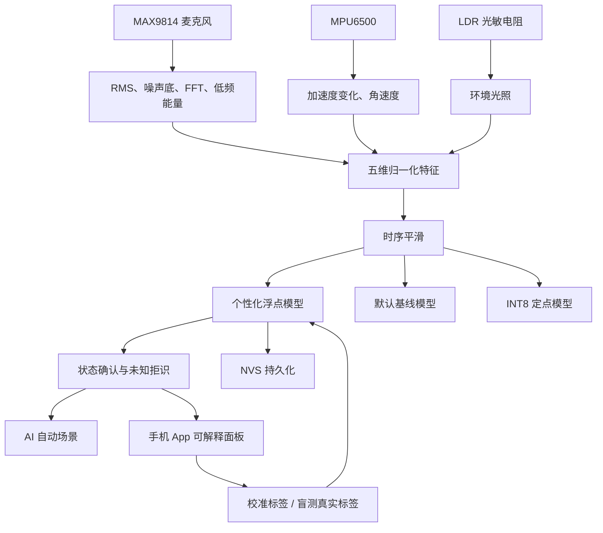
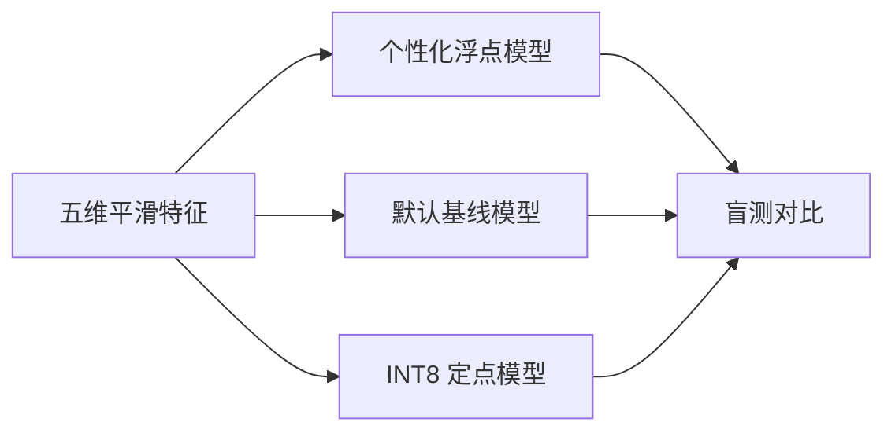

# PixelFlow Desk AI 桌面智能系统技术设计

## 1. 文档信息

| 项目 | 内容 |
|---|---|
| 项目名称 | PixelFlow Desk AI |
| 硬件平台 | ESP32-S3 + 32×8 WS2812B 点阵 |
| 固件版本 | v2.7.3 |
| Android App | v1.8.2，versionCode 14 |
| 推理位置 | ESP32-S3 本地端侧 |
| 主要任务 | 桌面状态识别、个性化校准、智能场景切换、盲测评估 |
| 状态类别 | 专注、会议、休息、离开 |

本文档说明桌面 AI 的完整设计，包括数据来源、五维特征、三种模型、个性化校准、主动学习、未知拒识、盲测评估、智能场景、隐私保护和比赛展示。

需要准确说明：当前系统不是神经网络，也没有使用 TensorFlow Lite。它是一套针对 ESP32-S3 设计的、可解释的五维最近原型分类器，并行运行个性化浮点、默认基线和 INT8 定点量化三种推理路径。

---

## 2. 设计目标

桌面 AI 不只是增加一个显示模式，而是让设备形成完整闭环：

```text
感知桌面环境
→ 提取可解释特征
→ 判断用户状态
→ 自动调整显示和亮度
→ 接收用户标注
→ 完成个性化学习
→ 用独立盲测验证效果
```

主要目标包括：

1. 不依赖云端完成状态识别。
2. 不上传原始麦克风和姿态数据。
3. 允许用户根据自己的桌面环境进行校准。
4. 在证据不足时输出“未知”，而不是强制四选一。
5. 使用时序平滑减少状态抖动。
6. 同时给出默认基线、个性化和 INT8 结果，形成可复核对照。
7. 将识别结果用于显示场景和节能控制。
8. 通过模型锁定、隐藏预测和人工真值提交完成公平盲测。

---

## 3. 系统架构



ESP32-S3 负责传感器采集、特征提取、分类、评测统计和显示控制。手机 App 负责配置、标注、展示和证据导出，不承担 AI 推理。

---

## 4. 数据来源

### 4.1 MAX9814 麦克风

麦克风采样用于得到：

- 当前 RMS 音量；
- 峰值；
- 自适应噪声底；
- 32 段 FFT 频谱；
- 低频、中频和高频能量；
- 音频信号是否存在；
- 自动增益值；
- 鼓点状态。

系统不会保存完整原始语音，也不会进行语音内容识别。AI 只使用音量和频域能量等统计特征。

### 4.2 MPU6500

MPU6500 提供：

- 三轴加速度 `accelX/Y/Z`；
- 三轴角速度 `gyroX/Y/Z`；
- 设备是否在线；
- 读取成功和失败计数。

桌面 AI 使用相邻采样之间的加速度变化和角速度，不直接把设备固定安装斜度当作持续运动。

### 4.3 LDR 光敏电阻

LDR 输出 0～4095 的 ADC 数值。当前硬件分压方向为：

```text
ADC 数值越高 → 环境越暗
ADC 数值越低 → 环境越亮
```

因此 AI 使用的光照特征需要反向归一化。

### 4.4 系统时间

系统时间不直接参与四类原型距离计算，但用于：

- 判断长时间没有活动；
- 强制进入“离开”状态；
- 记录推理、校准、盲测和状态时间线。

### 4.5 当前没有直接参与分类的数据

下列数据会显示在 App 中，但当前不参与桌面 AI 四分类：

- HTU21D 温度；
- HTU21D 湿度；
- 天气数据；
- Wi-Fi SSID 和 RSSI；
- VBUS 电压；
- 游戏状态；
- 当前显示模式。

这样可以避免模型把网络或显示结果反向当成用户状态证据。

---

## 5. 五维特征

所有输入最终转换为 0～1 的五维特征：

```text
[音频活跃度, 低频能量, 姿态变化, 环境光照, 使用活跃度]
```

### 5.1 音频活跃度

近似计算为：

```text
有效音频 = max(0, RMS - 噪声底 × 1.08)

音频活跃度 =
clamp(
  有效音频 × 自动增益 × 5.2
  + 频谱总能量 × 自动增益 × 1.35,
  0, 1
)
```

噪声底会随环境缓慢更新，自动增益用于适应不同麦克风增益和桌面距离。

### 5.2 低频能量

```text
低频特征 =
clamp(FFT低频平均能量 × 自动增益 × 2.7, 0, 1)
```

该特征用于辅助区分会议、人声、低频音乐与安静环境。

### 5.3 姿态变化

```text
加速度变化 =
|ax - 上次ax| + |ay - 上次ay| + |az - 上次az|

角速度活动 =
(|gx| + |gy| + |gz|) × 0.008

姿态特征 =
clamp(加速度变化 × 0.85 + 角速度活动, 0, 1)
```

使用相对变化能够降低固定斜度、安装误差和重力分量对判断的影响。

### 5.4 环境光照

```text
环境光照 = 1 - clamp(LDR原始值 / 4095, 0, 1)
```

解释如下：

```text
0.0 → 很暗
1.0 → 很亮
```

### 5.5 使用活跃度

```text
使用活跃度 =
clamp(
  max(音频活跃度 × 0.82, 姿态变化 × 0.95),
  0, 1
)
```

它表示当前桌面是否存在明显使用行为。

---

## 6. 时序处理

### 6.1 特征平滑

为了降低单帧噪声，系统对五维特征进行指数平滑：

```text
平滑值 = 旧值 × (1 - α) + 新值 × α
```

当前参数：

| 特征 | 新值权重 α |
|---|---:|
| 姿态变化 | 0.72 |
| 其他特征 | 0.38 |

姿态变化需要更快响应，因此使用更高的新值权重。

### 6.2 状态确认

候选状态需要连续出现至少 3 次才会稳定切换。AI 默认每 1 秒推理一次，因此普通状态变化通常需要数秒确认。

### 6.3 离开超时

如果使用活跃度、音频活动和姿态活动持续约 90 秒没有有效更新，系统强制输出“离开”。

### 6.4 状态时间线

出现下列情况时记录一条时间线：

- 状态发生变化；
- 距离上一次记录达到约 30 秒。

每条记录包含：

```text
时间戳、状态、置信度、是否离线推理
```

---

## 7. 分类算法

四种状态分别拥有一个五维特征中心：

```text
专注中心
会议中心
休息中心
离开中心
```

系统计算当前特征与每个中心之间的加权欧氏距离：

```text
距离 =
sqrt(
  Σ((当前特征 - 类别中心)² × 特征权重)
  / Σ特征权重
)
```

当前浮点特征权重：

| 特征 | 权重 |
|---|---:|
| 音频活跃度 | 1.20 |
| 低频能量 | 0.72 |
| 姿态变化 | 1.28 |
| 环境光照 | 0.54 |
| 使用活跃度 | 1.08 |

距离最小的类别成为候选类别。每类得分近似为：

```text
类别得分 = clamp(1 - 类别距离, 0, 1)
```

置信度同时考虑：

- 最佳类别本身的距离；
- 最佳类别与第二名之间的区分度。

```text
区分度 =
clamp((第二名距离 - 最佳距离) / 0.55, 0, 1)

置信度 =
clamp((1 - 最佳距离) × 0.62 + 区分度 × 0.38, 0, 1)
```

---

## 8. 三种模型

三种模型共享同一套五维特征，区别在于原型来源和计算精度。



### 8.1 默认基线模型

默认基线模型使用固件中人工设定的通用中心：

| 状态 | 音频 | 低频 | 姿态 | 光照 | 活跃度 |
|---|---:|---:|---:|---:|---:|
| 专注 | 0.10 | 0.09 | 0.05 | 0.38 | 0.13 |
| 会议 | 0.62 | 0.38 | 0.14 | 0.45 | 0.74 |
| 休息 | 0.05 | 0.05 | 0.03 | 0.22 | 0.04 |
| 离开 | 0.01 | 0.01 | 0.01 | 0.07 | 0.00 |

它的作用是：

1. 新设备没有校准样本时提供初始原型。
2. 在盲测中作为固定对照组。
3. 衡量个性化学习是否真正提高准确率。
4. 防止只展示个性化结果而缺少基线证据。

默认基线不会被用户校准修改，也不直接驱动当前 AI 自动场景。

需要准确描述：这些中心是工程初始原型，不是通过大规模离线数据集训练出的神经网络参数。

### 8.2 个性化浮点模型

个性化模型初始复制默认中心，然后根据用户提交的真实校准标签逐步更新。

当用户在真实“专注”状态点击“专注校准”时，系统读取当前五维特征，仅更新专注中心：

```text
新中心 = 旧中心 × (1 - α) + 当前样本 × α
```

更新系数：

- 第一条样本：`α = 0.45`；
- 后续样本：按累计样本数做增量平均；
- 样本数超过 12 后，单次更新权重保持约 `1/12`。

这种处理保留一部分默认先验，同时逐步适应：

- 不同用户的工作习惯；
- 不同麦克风增益；
- 不同环境噪声；
- 不同房间光照；
- 不同设备摆放方式。

个性化模型的作用是：

1. 作为设备日常运行的主模型。
2. 驱动 AI 自动场景。
3. 生成个性化预测、置信度和未知拒识。
4. 与默认基线比较个性化收益。

个性化中心和样本数保存到 ESP32-S3 NVS，重启后仍然保留。

### 8.3 INT8 定点模型

INT8 模型不是独立训练出的第三套模型，而是个性化模型的定点量化推理版本。

量化方式：

```text
浮点特征 0.0～1.0
        × 127
        ↓
整数特征 0～127
```

例如：

```text
0.10 → 13
0.55 → 70
0.92 → 117
```

当前整数权重为：

```text
[12, 7, 13, 5, 11]
```

它们分别对应音频、低频、姿态、光照和活跃度，与浮点权重保持近似比例。

INT8 路径使用整数平方距离完成分类，并单独记录：

- INT8 预测状态；
- INT8 置信度；
- INT8 推理耗时；
- INT8 盲测正确数和准确率。

INT8 模型的作用是：

1. 验证轻量整数计算能否保持浮点模型效果。
2. 展示算法适合资源受限的 ESP32-S3。
3. 比较量化前后的精度损失。
4. 为后续完全使用定点推理提供依据。

当前自动场景由个性化浮点模型驱动。INT8 路径在每次推理中并行运行，主要用于评测对照。

---

## 9. 三种模型的评测关系

每次推理同时产生：

```text
个性化浮点预测
默认基线预测
INT8量化预测
```

锁定模型并提交真实标签后，系统比较三者：

| 模型 | 回答的问题 |
|---|---|
| 默认基线 | 不做用户校准时效果如何？ |
| 个性化模型 | 个性化学习是否改善当前用户的识别？ |
| INT8 模型 | 量化后能否保持个性化模型效果？ |

期望结果：

```text
个性化准确率 > 默认基线准确率
INT8准确率 ≈ 个性化浮点准确率
INT8推理成本不高于浮点推理
```

如果个性化准确率低于默认基线，通常说明：

- 校准样本太少；
- 校准状态不纯；
- 四类特征中心过于接近；
- 校准和真实使用环境差异过大；
- 标签提交错误。

---

## 10. 个性化校准

### 10.1 校准目的

校准用于“教模型”，会修改个性化中心。

四种状态都需要采集：

```text
专注、会议、休息、离开
```

### 10.2 样本要求

| 要求 | 当前设置 |
|---|---:|
| 每类最低样本数 | 4 |
| 每类推荐样本数 | 8 |
| 建议总样本数 | 32 |

不建议在完全相同的瞬间连续点击多次。更好的采集方式是：

1. 保持状态数秒；
2. 等待特征平滑；
3. 提交一次标签；
4. 轻微改变真实环境；
5. 再提交下一条样本。

### 10.3 画像覆盖率

某类别达到至少 4 条样本后，计为一个已覆盖类别。全部四类覆盖后，覆盖率为 `4 / 4`。

### 10.4 原型区分度

系统计算各类别中心两两之间的平均距离。距离过小意味着模型难以区分类别。

当前模型进入“可验证”状态需要：

```text
四类全部覆盖
并且
平均中心区分度 ≥ 0.12
```

### 10.5 画像质量

画像质量不是准确率，其组成是：

```text
画像质量 =
样本覆盖与数量得分 × 70%
+ 原型区分度得分 × 30%
```

它只表示模型是否具备开始验证的基础条件。

---

## 11. 主动学习

当模型长期处于低置信度，并满足等待和冷却条件时，App 会询问：

```text
当前真实状态是什么？
```

用户提交标签后，系统会：

1. 记录本次预测和真实标签；
2. 更新对应类别的个性化中心；
3. 关闭本次询问；
4. 增加闭环学习次数。

主动学习适合日常使用，但不适合正式盲测。模型锁定后，主动学习和校准都会被冻结。

---

## 12. 未知拒识

系统不会在证据不足时强制输出四个状态之一。

满足任一条件时输出“未知”：

```text
个性化置信度 < 0.30
或
当前特征与最佳中心距离 > 0.58
```

未知拒识的价值：

1. 降低错误自动切换。
2. 真实反映模型能力边界。
3. 为主动学习提供触发依据。
4. 在比赛评测中记录拒识次数，避免只统计成功样本。

---

## 13. 模型指纹

系统对下列内容计算 FNV-1a 哈希：

- 四类个性化特征中心；
- 四类校准样本数。

得到 8 位十六进制模型指纹，例如：

```text
模型 7A31C4D8
```

模型指纹用于证明：

1. 盲测前后模型是否发生变化。
2. 校准数据是否被锁定。
3. 导出的证据是否对应同一模型版本。

提交验证标签不会改变模型指纹；继续校准或主动学习会改变模型指纹。

---

## 14. 标准盲测流程

### 14.1 为什么需要盲测

校准数据属于训练样本，不能直接用于计算准确率。否则相当于用训练题考试，结果会虚高。

### 14.2 锁定模型

当画像满足覆盖率和区分度要求后，点击：

```text
锁定并开始盲测
```

锁定后：

- 禁止继续校准；
- 禁止主动学习；
- 模型指纹固定；
- App 隐藏当前预测；
- 等待测试人员提交真实标签。

### 14.3 提交真实标签

设备先完成推理，但不向测试人员显示结果。测试人员根据现场真实情况选择：

```text
专注 / 会议 / 休息 / 离开
```

提交后，系统揭示并记录：

- 真实状态；
- 个性化模型预测；
- 默认基线预测；
- INT8 模型预测；
- 个性化置信度；
- 记录时间。

### 14.4 自动场景与盲测

正式盲测时应关闭 AI 自动场景。否则硬件显示模式可能提前暴露预测结果，破坏盲测公平性。

建议将两个演示环节分开：

```text
AI 自动场景：展示使用效果
模型锁定盲测：展示识别证据
```

---

## 15. 评测结果

### 15.1 单次结果

一次盲测示例：

```text
真实状态：会议
个性化预测：会议
默认基线：专注
INT8预测：会议
个性化置信度：76%
```

### 15.2 累计指标

系统累计以下数据：

- 验证总样本数；
- 个性化正确数；
- 默认基线正确数；
- INT8 正确数；
- 未知拒识次数；
- 四类真实样本数；
- 4×4 混淆矩阵；
- 每类召回率；
- 三种模型准确率；
- 个性化相对基线提升。

### 15.3 准确率

```text
准确率 = 正确预测数 / 验证总样本数
```

分别计算：

```text
个性化准确率
默认基线准确率
INT8准确率
```

### 15.4 召回率

某状态召回率：

```text
该状态预测正确数 / 该状态真实样本总数
```

召回率能够发现“总体准确率尚可，但某一类别几乎识别不出来”的问题。

### 15.5 混淆矩阵

混淆矩阵为 4×4：

```text
行：真实状态
列：个性化模型预测
```

例如“会议”经常出现在“专注”列，说明这两个类别的特征中心或校准环境过于相似。

### 15.6 个性化提升

```text
提升百分点 =
(个性化正确数 - 默认基线正确数)
/ 验证总样本数 × 100
```

该指标直接回答“用户校准是否有价值”。

---

## 16. AI 自动场景

AI 自动场景读取个性化浮点模型输出，并映射为硬件效果：

| AI 状态 | 当前显示行为 | AI 指示色 |
|---|---|---|
| 专注 | 时钟 | 绿色 |
| 会议 | 时钟 | 紫色 |
| 休息 | 流体 | 橙色 |
| 离开 | 时钟，节能模式下降至极低亮度 | 蓝色 |
| 未知 | 保持原场景，不强制切换 | 不显示状态色 |

屏幕右上角使用一个或两个像素表示 AI 状态：

- 颜色表示状态；
- 亮度表示置信度；
- 置信度达到约 58% 时显示两个像素。

### 16.1 与规则智能场景的关系

规则智能场景不使用四分类模型，而是根据时间、暗光、声音、姿态和计时状态执行确定性规则。

当前统一优先级：

```text
计时
> 暗光/安静时段
> 主动姿态交互
> 音频活动
> AI自动场景
> 手动模式
```

比赛展示 AI 自动场景时，建议关闭规则智能场景，避免无法判断是哪一条规则触发了画面变化。

---

## 17. 离线推理与隐私

桌面状态识别完全在 ESP32-S3 上运行：

- 不调用云端 AI；
- 不上传麦克风原始采样；
- 不上传 MPU 原始轨迹；
- 不上传个性化特征中心；
- 不需要手机保持连接；
- Wi-Fi 断开后仍能继续推理。

系统记录：

- 总推理次数；
- 离线推理次数；
- 最近一次推理是否离线；
- 最近离线推理时间。

联网只用于：

- 手机 App 访问设备 API；
- 获取天气；
- 城市地理编码；
- NTP 对时。

天气和对时请求不参与桌面 AI 分类。

---

## 18. 运行可靠性

系统记录以下工程指标：

- 浮点推理耗时；
- INT8 推理耗时；
- 总推理次数；
- 最低空闲堆；
- 各任务剩余栈空间；
- 显示帧率；
- Wi-Fi 断连次数；
- 复位原因；
- 外部网络请求次数。

这些数据用于证明 AI 功能不是脱离主系统运行的演示脚本，而是能够与显示、音频、传感器、天气和 Web 服务长期并行运行。

---

## 19. 数据持久化

### 19.1 保存到 NVS

以下数据会保存到 ESP32-S3 NVS：

- AI 启用状态；
- AI 自动场景开关；
- 主动学习开关；
- 主动询问阈值；
- 四类个性化特征中心；
- 四类校准样本数。

### 19.2 运行时数据

以下数据主要保存在运行内存：

- 当前五维特征；
- 当前预测和置信度；
- 状态时间线；
- 盲测结果；
- 混淆矩阵；
- 准确率统计；
- 离线推理计数。

重启设备前应先导出比赛证据包，避免丢失当前验证记录。

---

## 20. 手机 App 的作用

手机 App 不执行 AI 推理，主要负责：

1. 展示当前状态和置信度。
2. 展示五维特征条。
3. 展示可解释判断。
4. 提交个性化校准标签。
5. 响应低置信度主动询问。
6. 锁定或解锁模型。
7. 提交盲测真实标签。
8. 展示三种模型对照。
9. 展示准确率、召回率和混淆矩阵。
10. 展示模型指纹和状态时间线。
11. 导出比赛证据 JSON。
12. 控制 AI 自动场景和节能模式。

通信流程：

```text
ESP32 推理
→ /api/state 或 WebSocket
→ App 可视化

App 提交标签
→ POST /api/control
→ ESP32 更新校准或评测状态
```

---

## 21. 推荐使用流程

### 21.1 日常使用

```text
完成四类个性化校准
→ 打开本地分类
→ 打开 AI 自动场景
→ 允许主动学习
→ 根据询问继续修正模型
```

### 21.2 比赛盲测

```text
关闭离线演示数据
→ 关闭规则智能场景
→ 关闭 AI 自动场景
→ 每类完成至少 4 次、推荐 8 次校准
→ 确认画像覆盖 4/4
→ 锁定模型
→ 使用独立测试状态
→ 由评委提交真实标签
→ 查看三种模型结果
→ 累计至少 32 条盲测
→ 导出证据包
```

### 21.3 离线能力展示

```text
保持 AI 已启用
→ 记录当前推理次数
→ 断开手机热点
→ 改变声音、姿态和光照
→ 查看状态仍然变化
→ 重新连接 App
→ 查看离线推理次数增加
```

---

## 22. 当前边界

1. 当前模型是最近原型分类器，不是深度神经网络。
2. 默认中心是工程初始模板，不是大型公开数据集训练结果。
3. 当前只识别四种桌面状态。
4. 当前特征不包含时间上下文序列模型。
5. “专注”和“会议”当前都映射为时钟，硬件差异主要依赖 AI 指示色。
6. INT8 当前作为并行评测路径，没有直接驱动自动场景。
7. 验证记录主要保存在运行内存，重启前需要导出。
8. 模型效果依赖真实、均衡且正确的用户标签。
9. 自动场景打开时可能通过硬件画面暴露预测，因此不能与正式盲测同时使用。

这些边界应在比赛答辩中主动说明，避免把工程原型描述成不存在的神经网络或云端训练系统。

---

## 23. 后续优化方向

### 23.1 模型方向

- 增加滑动时间窗口特征；
- 使用决策树或小型时序分类器进行对照；
- 让 INT8 路径直接参与 A/B 场景控制；
- 增加模型版本和数据集版本；
- 增加交叉验证和置信区间；
- 增加自动阈值校准。

### 23.2 数据方向

- 为每条盲测记录保存完整五维特征；
- 保存三种模型的四类得分；
- 导出 CSV，便于绘制 ROC、PR 和混淆矩阵；
- 增加场景、日期和测试人员编号；
- 增加训练集与验证集重复检测。

### 23.3 自动场景方向

建议让四种状态产生更加明显的硬件差异：

| 状态 | 建议场景 |
|---|---|
| 专注 | 极简时钟或番茄钟 |
| 会议 | VU 表或镜像频谱 |
| 休息 | 流体动画 |
| 离开 | 极低亮时钟或待机 |
| 未知 | 保持原画面并在 App 请求标注 |

### 23.4 产品化方向

- 增加设备绑定和 Token 校验；
- 增加正式 APK 签名；
- 增加验证记录 NVS 或文件持久化；
- 增加 OTA 后模型迁移检查；
- 增加模型回滚；
- 增加隐私设置和数据清除入口。

---

## 24. 核心源码位置

| 文件 | 作用 |
|---|---|
| `src/desk_ai.cpp` | 五维特征、三种模型、校准、盲测、未知拒识 |
| `include/app_state.h` | AI 控制状态、运行状态和评测结构 |
| `src/app_state.cpp` | 多任务状态同步和盲测记录保护 |
| `src/scene_engine.cpp` | 规则场景与 AI 自动场景优先级 |
| `src/settings_storage.cpp` | 个性化中心和样本数 NVS 保存 |
| `src/web_server.cpp` | AI JSON 状态、标签和证据接口 |
| `src/competition_metrics.cpp` | 比赛运行、节能和可靠性指标 |
| `mobile_app/app.js` | App AI 面板、校准、盲测和证据展示 |
| `docs/COMPETITION_V2_7_DEMO_GUIDE.zh-CN.md` | 比赛演示流程 |
| `docs/COMPETITION_AI_EVIDENCE_PROTOCOL.zh-CN.md` | 比赛证据协议 |

---

## 25. 总结

PixelFlow Desk AI 的技术核心不是模型规模，而是完整的端侧闭环：

```text
真实传感器
→ 可解释五维特征
→ 默认基线
→ 个性化学习
→ INT8量化对照
→ 未知拒识与时序平滑
→ AI自动场景
→ 模型锁定盲测
→ 准确率和混淆矩阵
→ 离线、隐私和可靠性证据
```

默认基线回答“通用模板能做到什么”，个性化模型回答“用户校准是否有价值”，INT8 模型回答“轻量整数推理是否能够保持效果”。三者结合后，项目不仅能展示 AI 功能，还能解释模型从哪里来、为什么有效、如何验证，以及如何在 ESP32-S3 上可靠部署。
